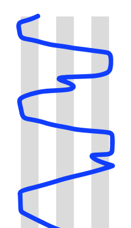

# Method templates

PDF links:

* [Minor](https://github.com/alexhunsley/various-paper-templates/raw/master/Bellringing%20Method%20Templates/Blueline%20Blanks/Minor/Method%20Template%20-%20Minor.pdf)
* [Major](https://github.com/alexhunsley/various-paper-templates/raw/master/Bellringing%20Method%20Templates/Blueline%20Blanks/Major/Method%20Template%20-%20Major.pdf)
* [Royal](https://github.com/alexhunsley/various-paper-templates/raw/master/Bellringing%20Method%20Templates/Blueline%20Blanks/Royal/Method%20Template%20-%20Royal.pdf)
* [Maximus](https://github.com/alexhunsley/various-paper-templates/raw/master/Bellringing%20Method%20Templates/Blueline%20Blanks/Maximus/Method%20Template%20-%20Maximus.pdf)

Note that the grey stripes represent a dodging pair -- so if you were filling in bob minor it would start like this:

